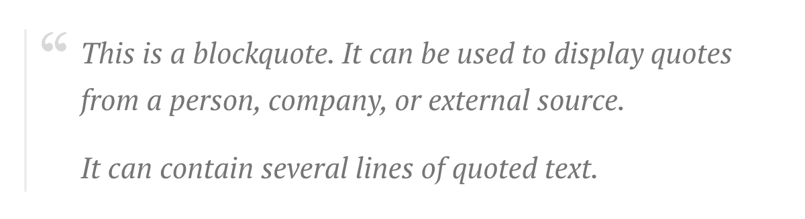
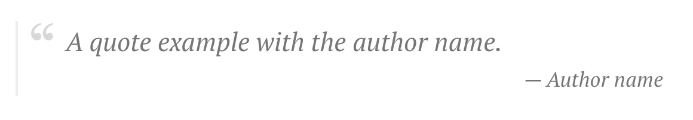

# Blockquote

Renders the styled blockquote element.

```markdown
> This is a blockquote.
> It can be used to display quotes from a person, company, or external source.
>
> It can contain several lines of quoted text.
```



A quote with the styled author's name aligned at the right:

```markdown
> A quote example with the author name.
> <small>— Author name</small>
```


