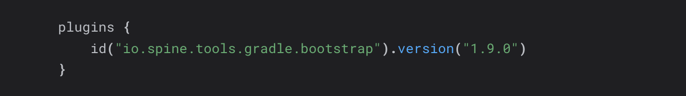
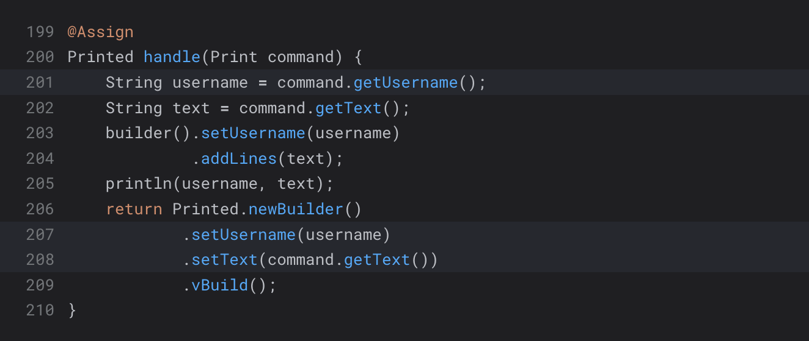
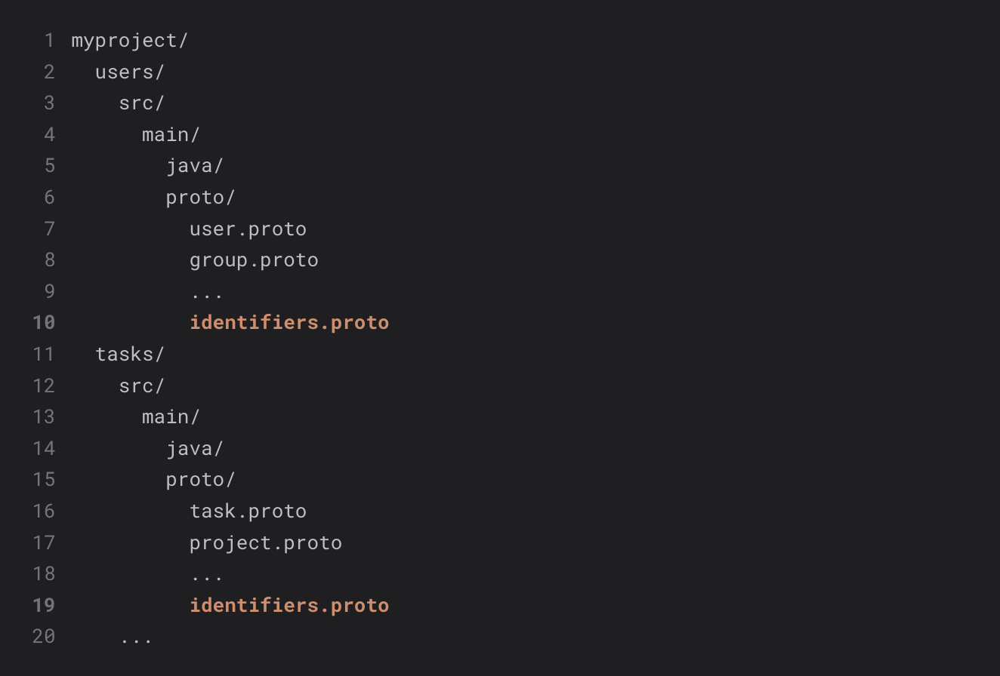

# Code blocks

There are two ways to add code blocks with syntax highlighting.

## 1. With triple backticks

Please always specify the [language syntax][syntax-highlighting-languages]
to avoid problems with the layout.

````markdown
```gradle
plugins {
    id("io.spine.tools.gradle.bootstrap").version("1.9.0")
}
```
````



The appearance of Hugo code blocks can be configured using parameters,
as described in the official [documentation][code-fences-doc]:

* `linenos=table` – configures line numbers and renders them in a table view.
  The table view is necessary for correct copying of code.
* `hl_lines=[8,"15-17"]` – lists a set of line numbers or line number ranges
  to be additionally highlighted.
* `linenostart=199` – starts the line number count from 199.

````markdown
```java {linenos=table, hl_lines=[3,"9-10"], linenostart=199}
@Assign
Printed handle(Print command) {
    String username = command.getUsername();
    String text = command.getText();
    builder().setUsername(username)
             .addLines(text);
    println(username, text);
    return Printed.newBuilder()
            .setUsername(username)
            .setText(command.getText())
            .vBuild();
}
```
````



## 2. Using `highlight` shortcode

The `highlight` shortcode allows setting custom visibility options related to
this project, such as custom CSS classes, the text highlighting on the selected
line, a file name bar, etc.

```markdown

myproject/
  users/
    src/
      main/
        java/
        proto/
          user.proto
          group.proto
          ...
          identifiers.proto
  tasks/
    src/
      main/
        java/    
        proto/
          task.proto
          project.proto
          ...
          identifiers.proto
    ...

```

Where:

* `lang` – the language syntax. See the [supported languages][syntax-highlighting-languages].
* `params` – optional standard Hugo highlighting parameters as a string.
* `file` – an optional name of the code file to display on the code header panel.
* `class` – an optional class name that the code block will be wrapped in.

The class `hl-text-only` is predefined and used to highlight only the text without
highlighting the entire line with a background.



[code-fences-doc]: https://gohugo.io/content-management/syntax-highlighting/#highlighting-in-code-fences
[syntax-highlighting-languages]: https://gohugo.io/content-management/syntax-highlighting/#languages
