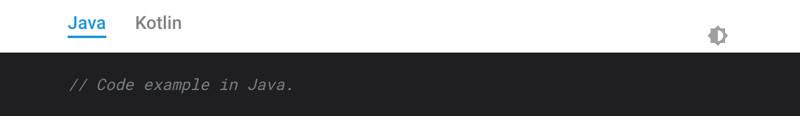

# Code tabs

Allows switching between code languages of the source code examples.

There are two types of code tabs widgets:

* **Synchronized**. This widget synchronizes its state with other widgets with
  the same set of languages. For example, when a user switches to "Java" in
  a single "Java, Kotlin" widget, the rest of such widgets will switch
  to the "Java" tab automatically.

  The selected language will be saved in cookies and restored on the page reload.

  Shortcode: ``

* **Standalone**. This widget will not change the state of other widgets, neither
  other widgets will change the state of a standalone widget.

  The selected language is not persisted.

  Shortcode: ``

The scenario of having different tabs with different languages on the same
page is supported.

## Usage

````markdown


```java
// Code example in Java.
```



```kotlin
// Code example in Kotlin.
```


````

or standalone tabs usage:

````markdown


```java
// Code example in Java.
```



```kotlin
// Code example in Kotlin.
```


````

Note: when adding snippets to Markdown pages, remember to format them
with lines of three backticks (```) and a code language.

The code will be rendered as:
```html
<div class="code-tabs">
   <div class="tabs">
       <div class="tab" lang="Java">Java</div>
       <div class="tab" lang="Kotlin">Kotlin</div>
   </div>
   <div class="code-tab-content" lang="Java">
        <pre>
          <code>// Code example in Java.</code>
        </pre>
   </div>
   <div class="code-tab-content" lang="Kotlin">
        <pre>
          <code>// Code example in Kotlin.</code>
        </pre>
   </div>
</div>
```


