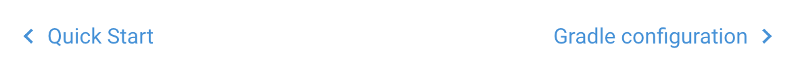

# Next/Prev bottom navigation

Renders `Previous`/`Next` links at the bottom of docs pages.

This component is automatic in the documentation `three-column` layout
and does not require a shortcode in page content.

The component is based on the documentation [sidenav](sidenav.md) items.
If there is no next or previous page, the button will not be rendered.

