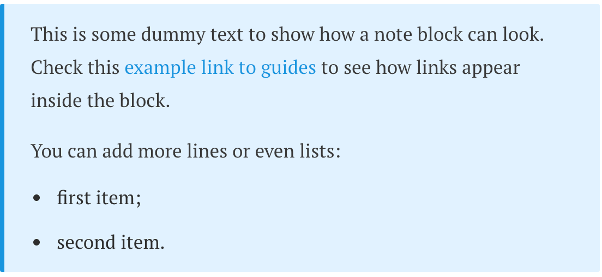

# Note block

Renders the text in a note block with additional styles.

The allowed classes are restricted to predefined options: `note`, `warning`, and `lead`.

### Note

```markdown
{}
This is some dummy text to show how a note block can look. Check this 
[example link to guides][test-url] to see how links appear inside the block.

You can add more lines or even lists:
* first item;
* second item.
{}

[test-url]: docs/quick-start/
```



### Lead

```markdown
{}
The lead subtitle text here.
{}
```


### Warning

```markdown
{}
The warning block with the [test link to guides][docs/quick-start/].
{}
```


