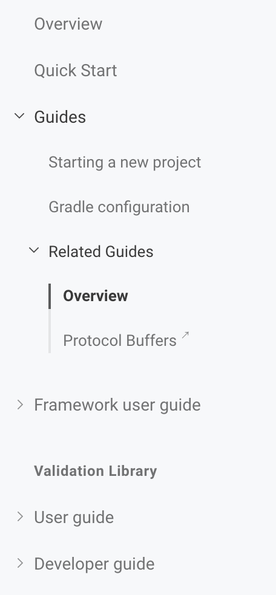

# Sidenav

The documentation sidenav is rendered from YAML data files and supports
nested sections, categories, page links, and external links.

Sidenav data files can be defined in these locations:

- `data/docs/sidenav.yml` for unversioned root docs.
- `data/docs/<version>/sidenav.yml` for versioned root docs.
- `data/docs/<module>/sidenav.yml` for unversioned module docs.
- `data/docs/<module>/<version>/sidenav.yml` for versioned module docs.

The item fields are:

* `page` – the label shown in the UI.
* `key` – the unique id for collapsible section/category items.
* `children` – the nested list of items.
* `file_path` – the path to a Hugo page (resolved against a version/module content path).
* `url` – the explicit URL. External links are opened in a new tab.

Example:

```yaml
- page: Overview
  file_path: "" # The path for `content/docs/_index.md`
- page: Quick Start
  file_path: quick-start
- page: Guides
  key: guides
  children:
    - page: Starting a new project
      file_path: guides/start-new-project
    - page: Gradle configuration
      file_path: guides/gradle
    - page: Related Guides
      key: related-guides
      children:
        - page: Overview
          file_path: guides/related-guides
        - page: Protocol Buffers
          url: https://developers.google.com/protocol-buffers/docs/overview

- separator: space
- page: Framework user guide
  key: framework
  children:
    - page: Overview
      file_path: framework

- section: Validation Library
- page: User guide
  key: user
  children:
    - page: Overview
      file_path: user/00-intro
- page: Developer guide
  key: developer
  children:
    - page: Overview and audience
      file_path: developer/overview-and-audience
```

Notes:

* Root-level items with `children` are rendered as sections.
* Nested items with `children` are rendered as categories.
* A section opens automatically when its `key` matches the current docs section.
* A category opens automatically when its `key` matches the current page parent directory.
* The separator can be added as a `space` or `line`.
* `section: <label>` renders a standalone section title. 
  Add `file_path` to make the title link to a Hugo page if needed.
  The section automatically adds top spacing.

How it looks:


